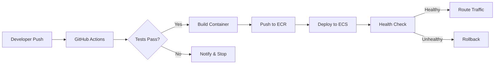

# Building a Cloud-Native Deployment Pipeline from Scratch

Deploying software reliably is one of those problems that *seems* simple until you actually try to do it well. Over the past year, I have built several deployment pipelines from the ground up, and I want to share the patterns that have worked — along with real code you can adapt for your own projects.

> **The goal is not just automation — it is building a system you can trust to ship code at 2 AM without waking anyone up.**

---

## Architecture Overview

Before writing any code, it helps to understand the full picture. Here is the high-level architecture of the pipeline we will build:



The key insight is that every stage has a **gate** — a condition that must be met before proceeding. This is what makes the pipeline trustworthy.

---

## Prerequisites

Before we start, make sure you have the following tools installed and configured:

- [x] AWS CLI configured with appropriate credentials
- [x] Terraform >= 1.5
- [x] Docker installed and running
- [ ] GitHub repository with Actions enabled
- [ ] An AWS account with ECR and ECS permissions

---

## Step 1: Infrastructure as Code with Terraform

The foundation of any good pipeline is reproducible infrastructure. Here is the Terraform configuration for our ECS cluster and supporting resources.

<details>
<summary><strong>Full Terraform Configuration</strong> — Click to expand</summary>

```hcl
# main.tf — ECS Cluster and Service

terraform {
  required_version = ">= 1.5"
  required_providers {
    aws = {
      source  = "hashicorp/aws"
      version = "~> 5.0"
    }
  }

  backend "s3" {
    bucket = "my-terraform-state"
    key    = "pipeline/terraform.tfstate"
    region = "us-east-1"
  }
}

provider "aws" {
  region = var.aws_region
}

resource "aws_ecs_cluster" "main" {
  name = "${var.project_name}-cluster"

  setting {
    name  = "containerInsights"
    value = "enabled"
  }

  tags = var.common_tags
}

resource "aws_ecs_task_definition" "app" {
  family                   = "${var.project_name}-task"
  network_mode             = "awsvpc"
  requires_compatibilities = ["FARGATE"]
  cpu                      = var.task_cpu
  memory                   = var.task_memory
  execution_role_arn       = aws_iam_role.ecs_execution.arn
  task_role_arn            = aws_iam_role.ecs_task.arn

  container_definitions = jsonencode([
    {
      name      = var.project_name
      image     = "${aws_ecr_repository.app.repository_url}:latest"
      essential = true
      portMappings = [
        {
          containerPort = var.container_port
          protocol      = "tcp"
        }
      ]
      logConfiguration = {
        logDriver = "awslogs"
        options = {
          "awslogs-group"         = aws_cloudwatch_log_group.app.name
          "awslogs-region"        = var.aws_region
          "awslogs-stream-prefix" = "ecs"
        }
      }
    }
  ])
}

resource "aws_ecs_service" "app" {
  name            = "${var.project_name}-service"
  cluster         = aws_ecs_cluster.main.id
  task_definition = aws_ecs_task_definition.app.arn
  desired_count   = var.desired_count
  launch_type     = "FARGATE"

  network_configuration {
    subnets          = var.private_subnets
    security_groups  = [aws_security_group.ecs.id]
    assign_public_ip = false
  }

  load_balancer {
    target_group_arn = aws_lb_target_group.app.arn
    container_name   = var.project_name
    container_port   = var.container_port
  }

  deployment_circuit_breaker {
    enable   = true
    rollback = true
  }
}
```

</details>

### Variables File

The variables file keeps our configuration flexible across environments:

```hcl
# variables.tf

variable "project_name" {
  description = "Name of the project"
  type        = string
  default     = "my-app"
}

variable "aws_region" {
  description = "AWS region for resources"
  type        = string
  default     = "us-east-1"
}

variable "task_cpu" {
  description = "CPU units for the ECS task"
  type        = number
  default     = 256
}

variable "task_memory" {
  description = "Memory (MB) for the ECS task"
  type        = number
  default     = 512
}

variable "container_port" {
  description = "Port the container listens on"
  type        = number
  default     = 8080
}

variable "desired_count" {
  description = "Number of running tasks"
  type        = number
  default     = 2
}
```

---

## Step 2: Dockerizing the Application

A consistent container image is critical. Here is a multi-stage Dockerfile that keeps the final image lean:

```dockerfile
# Stage 1: Build
FROM node:20-alpine AS builder
WORKDIR /app
COPY package*.json ./
RUN npm ci --only=production
COPY . .
RUN npm run build

# Stage 2: Production
FROM node:20-alpine AS runner
WORKDIR /app
RUN addgroup -g 1001 -S appgroup && \
    adduser -S appuser -u 1001 -G appgroup
COPY --from=builder /app/dist ./dist
COPY --from=builder /app/node_modules ./node_modules
COPY --from=builder /app/package.json ./
USER appuser
EXPOSE 8080
HEALTHCHECK --interval=30s --timeout=3s \
  CMD wget --no-verbose --tries=1 --spider http://localhost:8080/health || exit 1
CMD ["node", "dist/server.js"]
```

<details>
<summary><strong>Why multi-stage builds matter</strong></summary>

Multi-stage builds give you two major advantages:

1. **Smaller images** — The final image only contains production dependencies and compiled output, not build tools or dev dependencies.
2. **Better security** — Fewer packages means a smaller attack surface. The build toolchain never makes it into production.

A typical reduction looks like this:

| Build Type | Image Size | Packages |
|---|---|---|
| Single-stage | ~950 MB | 847 |
| Multi-stage | ~180 MB | 123 |
| With `alpine` | ~85 MB | 41 |

The difference is significant, especially when you are pulling images across a network on every deployment.

</details>

---

## Step 3: The CI/CD Pipeline

This is where everything comes together. Here is the GitHub Actions workflow:

```yaml
# .github/workflows/deploy.yml

name: Deploy to Production

on:
  push:
    branches: [main]
  pull_request:
    branches: [main]

env:
  AWS_REGION: us-east-1
  ECR_REPOSITORY: my-app
  ECS_CLUSTER: my-app-cluster
  ECS_SERVICE: my-app-service

jobs:
  test:
    runs-on: ubuntu-latest
    steps:
      - uses: actions/checkout@v4

      - name: Setup Node.js
        uses: actions/setup-node@v4
        with:
          node-version: '20'
          cache: 'npm'

      - name: Install dependencies
        run: npm ci

      - name: Run linter
        run: npm run lint

      - name: Run tests
        run: npm test -- --coverage

      - name: Upload coverage
        uses: actions/upload-artifact@v4
        with:
          name: coverage-report
          path: coverage/

  build-and-deploy:
    needs: test
    if: github.ref == 'refs/heads/main'
    runs-on: ubuntu-latest
    permissions:
      id-token: write
      contents: read

    steps:
      - uses: actions/checkout@v4

      - name: Configure AWS credentials
        uses: aws-actions/configure-aws-credentials@v4
        with:
          role-to-assume: ${{ secrets.AWS_ROLE_ARN }}
          aws-region: ${{ env.AWS_REGION }}

      - name: Login to Amazon ECR
        id: ecr-login
        uses: aws-actions/amazon-ecr-login@v2

      - name: Build, tag, and push image
        env:
          ECR_REGISTRY: ${{ steps.ecr-login.outputs.registry }}
          IMAGE_TAG: ${{ github.sha }}
        run: |
          docker build -t $ECR_REGISTRY/$ECR_REPOSITORY:$IMAGE_TAG .
          docker build -t $ECR_REGISTRY/$ECR_REPOSITORY:latest .
          docker push $ECR_REGISTRY/$ECR_REPOSITORY:$IMAGE_TAG
          docker push $ECR_REGISTRY/$ECR_REPOSITORY:latest

      - name: Deploy to ECS
        run: |
          aws ecs update-service \
            --cluster $ECS_CLUSTER \
            --service $ECS_SERVICE \
            --force-new-deployment
```

---

## Step 4: Monitoring and Rollbacks

A pipeline is only as good as its ability to detect and recover from failures. Here is a simple health check script that runs after deployment:

```bash
#!/bin/bash
# scripts/health-check.sh

set -euo pipefail

SERVICE_URL="${1:?Usage: health-check.sh <service-url>}"
MAX_RETRIES=30
RETRY_INTERVAL=10

echo "Checking health of $SERVICE_URL"

for i in $(seq 1 $MAX_RETRIES); do
  STATUS=$(curl -s -o /dev/null -w "%{http_code}" "$SERVICE_URL/health" || true)

  if [ "$STATUS" = "200" ]; then
    echo "Service is healthy (attempt $i/$MAX_RETRIES)"
    exit 0
  fi

  echo "Attempt $i/$MAX_RETRIES — Status: $STATUS (waiting ${RETRY_INTERVAL}s)"
  sleep $RETRY_INTERVAL
done

echo "ERROR: Service did not become healthy after $MAX_RETRIES attempts"
exit 1
```

<details>
<summary><strong>Automatic rollback with ECS circuit breaker</strong></summary>

The `deployment_circuit_breaker` block in our Terraform config enables automatic rollback:

```hcl
deployment_circuit_breaker {
  enable   = true
  rollback = true
}
```

When ECS detects that new tasks are failing to stabilize, it automatically:

1. Stops the deployment
2. Rolls back to the last stable task definition
3. Reports the failure in the deployment events

This works without any custom scripts and is one of the most underutilized features of ECS. You can monitor it with:

```bash
aws ecs describe-services \
  --cluster my-app-cluster \
  --services my-app-service \
  --query 'services[0].deployments'
```

</details>

---

## Environment Comparison

Here is how the pipeline configuration differs across environments:

| Setting | Development | Staging | Production |
|---|---|---|---|
| Task count | 1 | 2 | 4 |
| CPU (units) | 256 | 512 | 1024 |
| Memory (MB) | 512 | 1024 | 2048 |
| Auto-scaling | Off | On (2-4) | On (4-12) |
| Circuit breaker | Off | On | On |
| Deployment type | Rolling | Blue/Green | Blue/Green |

---

## Lessons Learned

After building this pipeline and running it in production for several months, here are the key takeaways:

1. **Start with the rollback strategy.** Before you automate deployment, make sure you can undo it. The `deployment_circuit_breaker` in ECS is a good starting point, but you should also have a manual rollback procedure documented.

2. **Tag images with the commit SHA, not just `latest`.** This makes it trivial to trace a running container back to the exact code that built it.

3. **Use OIDC for AWS authentication in CI.** ~~Long-lived access keys in GitHub Secrets~~ are a security risk. OIDC federation with `aws-actions/configure-aws-credentials` is the modern approach.

4. **Log everything, alert selectively.** Ship all logs to CloudWatch, but only send alerts for actionable conditions. Alert fatigue is real.

<details>
<summary><strong>A note on cost</strong></summary>

Running this setup on AWS is not free, but it is more affordable than many expect. Here is a rough monthly estimate for a small production workload:

- **ECS Fargate** (2 tasks, 0.25 vCPU, 512MB): ~$15/month
- **Application Load Balancer**: ~$18/month
- **ECR storage** (< 5 images): ~$0.50/month
- **CloudWatch Logs** (5 GB): ~$2.50/month
- **NAT Gateway**: ~$35/month

**Total: ~$71/month** for a fully managed, auto-scaling container deployment.

The NAT Gateway is the biggest cost driver. For non-production environments, consider using VPC endpoints or public subnets to avoid it entirely.

</details>

---

## What's Next

In a follow-up post, I plan to cover:

- Adding **canary deployments** with weighted target groups
- Implementing **infrastructure drift detection** with Terraform Cloud
- Setting up **distributed tracing** with AWS X-Ray

If you have questions or want to discuss pipeline architecture, feel free to [reach out](mailto:minutti70@gmail.com).
